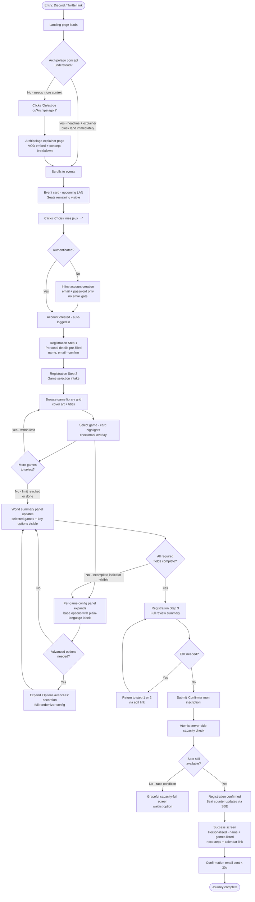
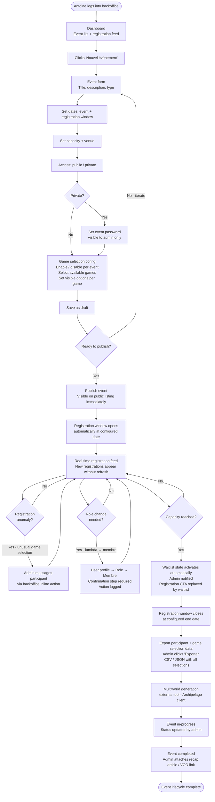
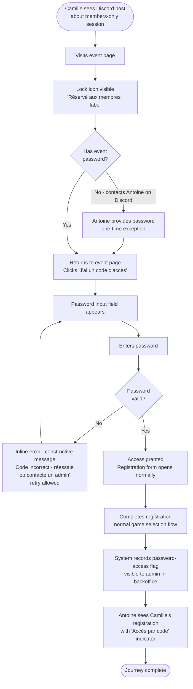

# UX Design Specification archilan.fr

**Author:** Jean
**Date:** 2026-04-24

---

## Executive Summary

### Project Vision

archilan.fr is simultaneously the public community hub and the internal operational ERP of ArchiLAN - the only structured Archipelago LAN association in France, informally recognized as the French-language branch of a 122,000-member global community. The product must convert a complete newcomer to Archipelago into an event participant in a single visit, while replacing all manual Discord-based event coordination with structured backoffice tooling for a ten-person volunteer team.

Three consecutive flagship LANs grew 14 → 30 → 50 participants (50 = venue cap, not demand cap), with Twitch Affiliate status established at 10 avg / 20 peak concurrent viewers. The site is designed from day one for evolution toward automated Archipelago multiworld server deployment (Year 3 vision) - v1 architecture decisions must not block this trajectory.

### Target Users

**Thomas - CS student, primary audience**
Second-year CS student at ISIMA Clermont-Ferrand. Discord/Twitch-native, plays roguelikes and metroidvanias, vaguely aware of randomizers but has zero Archipelago context. Arrives via a link dropped in a Discord server. Technically curious - will engage with complexity once the concept lands. Needs the "aha moment" to hit fast.

**Marie - General gaming public, secondary audience**
28-year-old game enthusiast, non-technical. Discovers ArchiLAN through a retweeted Twitch clip. Has zero context for what she watched. The site must make Archipelago approachable - the explainer has to resolve the concept before she loses interest. If she gets it, she will register.

**Antoine - Volunteer admin, internal user**
CA member managing all event coordination today via Discord messages and a shared spreadsheet. Needs reliability and clarity above all. The backoffice must be operable under event-day pressure without training. Zero tolerance for ambiguity in registration data.

### Key Design Challenges

**1. Dual audience, single entry point**
The landing page must simultaneously signal a sharp, credible gaming/tech identity to Thomas and feel welcoming and comprehensible to Marie. These goals can conflict - the solution is a visual hierarchy that delivers legitimacy instantly (satisfying Thomas) before guiding into accessible explanation (for Marie).

**2. Converting zero-context visitors**
Marie arrives knowing nothing about Archipelago. The explainer section must trigger genuine understanding - ideally through a visual or narrative device that demonstrates the concept (e.g., an item from Hollow Knight appearing in Stardew Valley) rather than relying on text alone. The "aha moment" must land before the end of the first scroll.

**3. Game selection intake - complexity vs. accessibility**
The Archipelago-specific game selection form is the product's most novel and technically complex UX surface. Randomizer options vary per game and require configuration. The form must guide a first-timer (Marie) without condescending to a veteran (Thomas), using progressive disclosure to surface advanced options only when needed.

### Design Opportunities

**1. The visual "aha moment"**
Archipelago's core mechanic - items from one game appearing in another - is visually demonstrable. An animated or illustrated sequence showing this cross-game item flow could deliver the concept in seconds, before a single word is read. This is both the primary UX challenge and the site's biggest differentiator if executed well.

**2. Game selection as a delightful experience**
The registration + game selection flow is genuinely novel - no existing platform does this. Designed well, it can be the feature users talk about: choosing your game, seeing your world slot into a connected multiworld. This is an opportunity to make a form feel like part of the game.

**3. A site that feels alive**
Real-time seat counter during registration windows + automatic Twitch live/offline detection create ambient activity signals. Combined with event recaps and upcoming session listings, the site can communicate a living, active community even outside peak event periods.

---

## Core User Experience

### Defining Experience

archilan.fr has two distinct usage modes that must each feel native to their user:

**Public mode - Discovery to participation:** The defining experience is the conversion of a curious visitor (arriving with zero Archipelago context) into a registered event participant. This journey - landing page → Archipelago understanding → account creation → event registration → game selection intake - must complete without friction, external support, or prior knowledge. The game selection intake is the product's most novel surface: no existing event platform includes Archipelago-specific game configuration as part of registration. Getting this right is the product's primary UX challenge and its clearest differentiator.

**Internal mode - Event operation:** For volunteer admins, the defining experience is effortless event lifecycle management: create, publish, monitor registrations live, export game selection data - all without a single Discord DM or spreadsheet update. Reliability and operational clarity are the success criteria; aesthetics are secondary.

### Platform Strategy

- **Platform:** Web application only - no native mobile app in scope
- **Public pages (landing, events, registration):** Mobile-first - primary discovery surface is Discord/Twitter links opened on smartphone
- **Backoffice:** Desktop/tablet minimum - admins operate during events from laptop or tablet; keyboard navigation required
- **Responsive breakpoints:** Mobile < 768px, Tablet 768–1024px, Desktop > 1024px
- **Touch vs. keyboard:** Public registration flows designed for touch; backoffice designed for keyboard/mouse with full keyboard navigation support
- **Offline:** Not required - event-critical flows (registration, seat counter) require live connection by design

### Effortless Interactions

- **Account creation:** Email + password only, no email verification gate before browsing - Thomas must be registered and on the event form in under two minutes
- **Real-time seat counter:** Remaining capacity updates automatically on the event page - no user action, no page reload
- **Twitch integration:** Live/offline state auto-detected; embed appears when live, channel link when offline - no user intervention
- **HelloAsso checkout:** Fully embedded - no external redirect, no context switch
- **Game selection:** Base options pre-surfaced with plain-language descriptions; advanced randomizer configuration available via progressive disclosure - the form does not require Archipelago knowledge to complete at the basic level
- **Admin registration feed:** New registrations appear in the backoffice dashboard in real time - Antoine sees each signup as it arrives during registration windows

### Critical Success Moments

1. **The Archipelago "aha moment" (Marie/Thomas):** Within the first scroll of the landing page, the visitor must grasp what Archipelago is - ideally through a visual or narrative device demonstrating the cross-game item mechanic, not text alone. If this moment fails, the visitor exits before reaching any CTA.

2. **Game selection completion (Thomas/Marie):** The registration + game selection form must be completable by a first-timer without external help. Any point of confusion maps directly to missing game selection data in Antoine's export - an operational failure, not just a UX failure.

3. **First live registration (Antoine):** The moment Antoine sees the first real-time registration arrive in the backoffice dashboard without any manual action is the product's "this replaces my spreadsheet" moment. This transition must be unmistakable.

4. **Capacity boundary (all users):** When an event reaches capacity, the experience must be clear and graceful for registrants (waitlist, not error) and immediately visible to admins - a race condition or confusing state here destroys trust in the platform.

### Experience Principles

1. **Understanding before action** - No user is asked to act before they understand what they are doing. Archipelago is explained before registration CTAs appear. Game options are described in plain language before configuration is requested.

2. **Zero friction on the critical path** - Account creation → event registration → game selection must complete in one session with no interruptions, no redirects, and no ambiguous states.

3. **The site breathes** - Real-time signals (seat counter, Twitch status, admin feed) make the site feel active and alive, not static. A visitor during a registration window should sense momentum.

4. **Complexity on demand** - Advanced Archipelago randomizer options exist but are not visible by default. The form serves both a first-timer and a veteran without compromise.

5. **Backoffice: reliability first** - Admin tooling is evaluated on clarity and dependability under event-day pressure, not visual refinement. Ambiguity in registration data is the worst outcome; a plain but reliable interface is the right tradeoff.

---

## Desired Emotional Response

### Primary Emotional Goals

**For public visitors (Thomas / Marie):** The primary emotional arc is
*curiosity → comprehension → desire → belonging*. A visitor arrives curious
(or confused, in Marie's case), leaves understanding, and - if the product
works - registers feeling like they are joining something real. The product
must earn trust fast: the design signals legitimacy before a single word
is read.

**For volunteer admins (Antoine):** The primary emotional goal is
*control and calm*. Antoine currently operates in a state of managed chaos
(Discord, spreadsheet, manual follow-up). archilan.fr must replace that
with a feeling of confident oversight: he sees everything, can act on
anything, and trusts the data he is looking at.

### Emotional Journey Mapping

| Stage | Thomas | Marie | Antoine |
|---|---|---|---|
| First page load | Instant credibility - "this is legit" | Intrigue - "what did I just find" | Trust - "this is professional" |
| Archipelago explainer | Intellectual excitement - "this is clever" | The "aha" - concept resolves, desire follows | N/A |
| Account creation | Effortless - barely noticed | Confidence - guided, not gated | N/A |
| Event registration | Engagement - participating, not form-filling | Confidence - the form does not intimidate | Control - watching it happen live |
| Game selection | Curiosity + ownership - "my world, my games" | Guided confidence - options make sense | Trust in data completeness |
| Post-registration | Anticipation + belonging - "I'm in" | Warmth - welcomed, not just confirmed | Relief - registration closed cleanly |
| Event day / operation | Connection - cross-game item magic | Discovery - playing a familiar game in a new way | Calm - the system handles it |
| Return visit | Familiarity - community momentum | Continuity - they belong here now | Efficiency - operational muscle memory |

### Micro-Emotions

**Confidence over confusion** - Every form field, option, and action must be self-explanatory. The game selection intake is the highest-risk surface: a user who is unsure what to do will either abandon or submit incomplete data. Both outcomes are failures.

**Excitement over obligation** - Registration must feel like *joining*, not *processing*. The confirmation screen in particular should reinforce the emotional high, not just transact.

**Trust over skepticism** - The dark gaming aesthetic could read as amateur if not executed precisely. Visual and content decisions must constantly reinforce legitimacy - association transparency, clear event information, reliable real-time data.

**Belonging over isolation** - Both Thomas and Marie are joining a community, not just attending an event. Post-registration communication and the site's content layer (recaps, past events, growing attendance numbers) should make this tangible.

**Calm over stress (Antoine)** - Under event-day pressure, the backoffice must be readable at a glance. High-density information is acceptable; ambiguity is not. Any state that requires Antoine to interpret or investigate is a UX failure.

### Design Implications

- **Credibility on load** → Dark, sharp, professional gaming aesthetic from the first viewport; no amateur visual signals; association identity and history surfaced immediately
- **"Aha moment"** → Visual or animated sequence demonstrating the Archipelago cross-game item mechanic; comprehension triggered through show, not tell
- **Confidence during registration** → Clear multi-step progress indicators; plain-language game option descriptions; inline validation with constructive (not punitive) error messages; no dead ends
- **Belonging in confirmation** → Confirmation screen and email that welcome the registrant into the event by name, summarize their game choices, and set expectations - not a generic "your registration was received"
- **Control in backoffice** → Real-time registration feed with clear participant + game selection data; inline actions (message, cancel, export) available without navigation; capacity state always visible
- **Calm under pressure** → High information density with strong visual hierarchy; critical states (capacity reached, registration anomaly) surfaced proactively with clear affordances

### Emotional Design Principles

1. **Earn trust before asking for action** - Credibility signals (sharp design, real event history, association transparency) must land before CTAs appear. A visitor who does not trust the site will not register.

2. **The confirmation is part of the experience** - Registration completion is the emotional peak for public users. The confirmation screen and email must sustain and reinforce that peak - not deflate it with a transactional summary.

3. **Visible progress neutralizes anxiety** - Any multi-step flow (registration, game selection, HelloAsso checkout) must show the user where they are and what comes next. Uncertainty is the root cause of abandonment.

4. **Data confidence for admins** - Antoine must never be unsure whether the data he sees is current, complete, or reliable. Real-time updates, explicit state labels, and audit-visible actions are the emotional design tools for this goal.

5. **Delight is earned, not decorated** - Micro-moments of delight (the "aha" visual, game selection UX, live seat counter ticking down) must emerge from product substance, not decorative animation. If it does not serve comprehension or engagement, it does not ship.

---

## UX Pattern Analysis & Inspiration

### Inspiring Products Analysis

**Discord - community identity and real-time presence**
The primary daily environment for Thomas and a large share of the gaming
public. Discord succeeds by making community membership feel tangible and
alive: activity indicators, presence signals, and real-time message feeds
make a server feel like a place, not a list. The dark-first design
aesthetic is the established visual language of the gaming community -
it signals legitimacy before any content is read. Navigation is persistent
and spatial: users always know where they are within the community
structure. Onboarding is friction-minimal - invite link → join → you are
inside.

**Key patterns:** Dark-first visual identity as legitimacy signal;
persistent spatial navigation; real-time activity as ambient presence;
embedded media (images, video, links) without context switching.

---

**Steam - game discovery and event communication**
The authoritative reference for gaming product pages. Steam game cards
deliver instant visual identity through art direction alone - a user
recognizes a game before reading the title. Event and sale banners
communicate urgency and exclusivity without overwhelming. User reviews as
social proof are surfaced early and prominently. The store/library
separation creates clear mode distinction between browsing and owning.

**Key patterns:** Card-based browsing with strong visual hierarchy;
hero imagery that communicates identity before text; social proof (player
counts, reviews) surfaced at the decision point; clear state distinction
between "available" and "yours."

---

**itch.io - indie game community pages**
Highly relevant to the Archipelago audience (technically curious, indie
game adjacent). itch.io game pages feel like homes for projects, not
listings: full-bleed cover images, developer narrative, embedded media,
community comments. Progressive disclosure of technical details (system
requirements, file sizes) keeps the page accessible while satisfying
technical users who scroll further. The platform's visual looseness
works because each page has strong individual identity - a lesson for
archilan.fr's event detail pages.

**Key patterns:** Full-bleed hero that establishes identity; narrative
page structure (what it is → what it looks like → how to get it);
progressive disclosure of technical detail; community activity (comments,
ratings) surfaced below the fold.

---

**Backloggd / Letterboxd - community activity feeds**
Community-first platforms where the product experience is inseparable from
social signals: friends' activity, recent plays, lists. These platforms
make belonging visible - you can see the community moving. For
archilan.fr, the equivalent is past event recaps, attendance growth (14 →
30 → 50), and upcoming session listings: the site communicates momentum
even between events.

**Key patterns:** Activity and momentum signals surfaced on the main
view; social proof through participation counts; content that gives users
a reason to return outside peak activity periods.

---

**Linear - operational backoffice clarity**
The reference for high-density, keyboard-first operational interfaces.
Linear demonstrates that a dark, technically rich interface can feel calm
rather than overwhelming when visual hierarchy is precise and every
element earns its place. Status labels, priority signals, and inline
actions eliminate the need to navigate away from the list view. Antoine's
backoffice experience should draw from this: dense, clear, actionable
at a glance.

**Key patterns:** High information density with strong visual hierarchy;
inline actions without navigation; explicit state labels at every item;
keyboard-navigable throughout; dark theme that reads as professional,
not amateur.

### Transferable UX Patterns

**Navigation patterns:**
- **Persistent spatial navigation (Discord)** → Apply to backoffice
  sidebar: admins always know which section they are in (events /
  registrations / users / content) without navigating back
- **Mode separation (Steam)** → Apply to public/backoffice split: the
  visual language shift between public site and backoffice should be
  clear and intentional, not jarring

**Interaction patterns:**
- **Progressive disclosure (itch.io)** → Apply to game selection intake:
  base game options visible immediately; advanced randomizer configuration
  revealed on demand - first-timers are not overwhelmed, veterans are not
  constrained
- **Real-time activity signals (Discord)** → Apply to seat counter and
  backoffice registration feed: remaining capacity updating live, new
  registrations appearing without refresh - the site breathes
- **Inline actions (Linear)** → Apply to backoffice registration list:
  message, cancel, and export actions available without leaving the list
  view

**Visual patterns:**
- **Dark-first gaming aesthetic (Discord / Steam)** → The established
  visual language for legitimacy in this community; applied from the
  first viewport on the landing page
- **Card-based event browsing (Steam)** → Event cards on the listing page
  communicate identity through imagery before title; past events with
  attendance numbers provide social proof
- **Full-bleed hero (itch.io)** → Event detail pages and landing page
  hero communicate identity and atmosphere before text content

### Anti-Patterns to Avoid

- **Generic event platform registration (Eventbrite pattern)** -
  multi-step flows with no spatial context, redirect-based payment,
  generic confirmation emails. archilan.fr's registration must feel
  native and continuous, not outsourced.
- **Email verification gate before browsing** - requiring email
  confirmation before any authenticated action is possible is unnecessary
  friction; Thomas must be on the event form in under two minutes.
- **Technical jargon without context** - Archipelago randomizer options
  presented as raw configuration fields (seed, plando, yaml) without
  plain-language description will cause abandonment. Options must be
  described for a newcomer first; technical labels are secondary.
- **Decorative animation over substance** - Dark gaming aesthetics are
  frequently executed with heavy parallax, particle effects, and motion
  that obscures content. Animation on archilan.fr must serve
  comprehension (the Archipelago "aha" sequence) or be absent.
- **Ambiguous confirmation states** - Registration platforms that show a
  spinner with no feedback, or a success screen with no actionable next
  steps, leave users uncertain. Every terminal state must be explicit and
  welcoming.

### Design Inspiration Strategy

**Adopt:**
- Dark-first visual identity as the primary legitimacy signal (Discord /
  Steam) - this is the visual language Thomas speaks
- Real-time activity as ambient presence (Discord) - seat counter, Twitch
  status, backoffice feed
- High-density inline-action backoffice (Linear) - Antoine's operational
  interface

**Adapt:**
- Progressive disclosure from itch.io - modified for a structured form
  context (game selection) rather than a browseable page
- Card-based event browsing from Steam - adapted for a small event
  catalog with emphasis on availability state and registration CTA
- Community momentum signals from Backloggd/Letterboxd - adapted to
  show event attendance growth and upcoming sessions rather than friend
  activity

**Avoid:**
- Redirect-based payment/registration flows (Eventbrite) - HelloAsso
  embedded checkout is the answer
- Email verification gates before action (common in generic auth flows)
- Decorative-first animation at the expense of content clarity
- Raw technical configuration UX without guided plain-language framing

---

## Design System Foundation

### Design System Choice

**Foundation:** shadcn/ui component library, built on Radix UI primitives,
themed with Tailwind CSS.

This choice is directly consistent with the already-decided tech stack
(React + Tailwind CSS) and resolves the tension between development
velocity and brand uniqueness: shadcn/ui components are copied into the
codebase rather than installed as a black-box dependency, making every
component fully owned and modifiable without fighting a library's API.

### Rationale for Selection

- **No vendor lock-in:** Components live in the repository as editable
  source files. The game selection intake, the admin feed, and any
  unique interaction can be built by composing and modifying shadcn
  primitives rather than working around a library's constraints.
- **Accessibility by default:** Radix UI primitives handle focus
  management, ARIA attributes, and keyboard navigation - WCAG 2.1 AA
  compliance is the starting point, not a retrofit.
- **Dark mode first-class:** The system is designed for dark themes via
  CSS custom properties. The dark gaming aesthetic is applied globally
  through a single token layer, not component-by-component overrides.
- **Tailwind-native theming:** Design tokens (colors, radius, spacing)
  map directly to Tailwind CSS variables - one design decision propagates
  everywhere.
- **TypeScript-native:** Full type safety across all components, aligned
  with Next.js and the Symfony API contract.

### Implementation Approach

**Layer 1 - Design tokens (Tailwind theme):**
Global CSS variables defining the dark gaming palette (background,
surface, accent, text, border, status colors), border radius, and
typography scale. These tokens are the single source of truth - changing
a token propagates to every component.

**Layer 2 - shadcn/ui base components:**
Buttons, inputs, selects, checkboxes, dialogs, badges, cards, tables,
toasts - installed and immediately themed via Layer 1 tokens. Used
directly in forms, event cards, backoffice lists, and navigation.

**Layer 3 - Custom components built on shadcn primitives:**
- **Game selection intake** - multi-step form composing Select (game
  picker), Accordion (advanced options), Badge (selected games summary),
  and a custom progress indicator
- **Archipelago explainer** - custom animated or illustrated sequence;
  no component library equivalent exists
- **Real-time seat counter** - custom state display with SSE-driven
  updates, built on shadcn Badge and Progress primitives
- **Admin registration feed** - custom live list built on shadcn Table
  with SSE-driven row insertion and inline action dropdowns

### Customization Strategy

**Design token priorities (in order of visual impact):**
1. Color palette - dark background, surface layers, accent (ArchiLAN
   brand color TBD), semantic status colors (success, warning, error)
2. Typography - gaming-adjacent typeface for headings, high-legibility
   sans-serif for body; both sourced from Google Fonts or self-hosted
3. Border radius - sharp (2–4px) for a technical aesthetic; avoid
   excessive rounding that reads as consumer/generic
4. Spacing scale - Tailwind defaults are sufficient; no override needed

**Public site vs. backoffice theming:**
The same token system applies to both surfaces. The public site uses the
full dark gaming palette with atmospheric visual treatments (hero imagery,
gradients). The backoffice uses the same tokens but with higher
information density, tighter spacing, and reduced decorative elements -
same visual language, different register.

---

## Defining Experience

### 2.1 Defining Experience

**"Select your games, configure your world, join the multiworld."**

The defining experience of archilan.fr is the Archipelago game selection
intake: the structured flow through which a registered participant selects
their games, configures key randomizer options in plain language, and
submits their world configuration - enabling the volunteer team to
generate the multiworld without a single manual follow-up.

This interaction is what makes archilan.fr categorically different from
any existing event platform. No LAN management tool, event registration
system, or Archipelago platform includes this flow. It is the product's
primary UX innovation and the feature users will describe when
recommending the site to others.

The Archipelago "aha moment" on the landing page is the necessary
precondition - Marie must understand the concept before the game
selection form makes sense. But the game selection intake is the defining
experience: the moment the product delivers its unique promise.

### 2.2 User Mental Model

**Current approach (what archilan.fr replaces):**
A volunteer posts in Discord: "LAN registration open, DM me your game
choices." Participants reply with informal lists. The volunteer compiles
responses into a spreadsheet, follows up on missing or ambiguous entries,
and eventually generates a YAML configuration manually. Each edition
involves hours of manual collection and reconciliation.

**Mental models users bring to the game selection intake:**
- *Event registration* (Eventbrite, HelloAsso standalone) - they expect
  a form with personal details and a payment step. The game selection
  section is unexpected but familiar in form (checkboxes, selects).
- *Game character creator* - the closest experiential analogue for a
  gamer: configuring options before entering a game world. This mental
  model is the design target: game selection should feel like world
  configuration, not administrative data entry.
- *Software setup wizard* - technical users (Thomas) may approach
  randomizer options like a settings dialog. Progressive disclosure
  ensures advanced options are available without dominating the interface.

**Where users expect to get confused:**
- Archipelago game options vary by game - why does Hollow Knight have
  different options than Stardew Valley? The UI must make this feel
  natural, not arbitrary.
- "How many games can I select?" - capacity and constraint rules must be
  surfaced before the selection step, not after.
- "Did it save my selections?" - partial completion (selecting games but
  not yet configuring options) must be visibly tracked so users feel in
  control of their progress.

### 2.3 Success Criteria

**The game selection intake succeeds when:**
- A first-time Archipelago participant (Marie-type) completes the full
  flow without external help, in a single session, in under 10 minutes
- Every game option is understood without clicking away to the
  Archipelago wiki - plain-language descriptions are sufficient
- The admin export after registration close contains 100% of participant
  data with zero missing or ambiguous entries - no manual follow-up
  required
- Users can return to update their selections before the window closes
  and the interface makes the update path obvious
- Completion rate on the game selection step is ≥ 95% of started flows

**Feedback signals that tell users they're succeeding:**
- Selected games appear in a persistent summary panel as they are chosen
- Each configured option shows a confirmation state (checkmark, filled
  label) immediately
- A progress indicator shows "Step 2 of 3: Configure your games" - users
  always know where they are in the flow
- The submit button is disabled with an explanatory label until all
  required selections are made - no surprise validation failures on
  submission

### 2.4 Novel UX Patterns

The game selection intake is a **genuinely novel UX pattern** - no
existing design vocabulary covers it precisely. The closest analogues are:

- **Software setup wizards** (familiar structure, wrong emotional register)
- **Game character creators** (right emotional register, wrong information
  density)
- **Multi-select configuration forms** (right structure, no narrative)

**The innovation:** Combine the structural clarity of a wizard (step
progress, one decision at a time) with the emotional register of a game
configuration screen (you are building *your* world, not filling out a
form), executed through a progressive disclosure model that serves both
newcomers and veterans without compromise.

**Teaching strategy for the novel pattern:**
- The game library is visually browseable - game cover art and names
  surface immediately, not a bare dropdown
- Base options for each selected game auto-expand with plain-language
  labels and brief descriptions (no jargon)
- Advanced options are collapsed behind an "Advanced settings" accordion
  - veterans access them; newcomers never see them unless they look
- A persistent sidebar or summary panel shows the user's current world
  configuration evolving as they make selections - they see their world
  taking shape, not just filling fields

### 2.5 Experience Mechanics

**Initiation:**
The registration flow begins on the event detail page with a prominent
"Register" CTA. If the user is not authenticated, account creation
(email + password) is the first step - inline, not a redirect. Once
authenticated, the registration flow opens as a focused multi-step modal
or dedicated page.

**Step 1 - Personal registration:**
Name (pre-filled from account), email (pre-filled), any event-specific
fields (dietary, accessibility if applicable for a physical LAN). Fast
- users move through this in under 60 seconds.

**Step 2 - Game selection:**

1. *Game library grid:* All games enabled by the admin for this event
   are displayed as cards (cover art + title). The user clicks to select.
   Selected games are visually highlighted with a checkmark overlay.
   A maximum selection count (if configured by admin) is shown as a
   counter: "2 / 3 games selected."

2. *Per-game option configuration:* Each selected game expands a
   configuration panel below its card (or in a side drawer on desktop).
   Base options appear as labeled toggles or selects with plain-language
   descriptions. An "Advanced options" accordion is available for
   veteran configuration.

3. *World summary:* A persistent panel (sidebar on desktop, sticky
   bottom bar on mobile) shows the user's current selection: game names,
   key options set. Updates in real time as selections are made.

**Feedback during interaction:**
- Selected state is immediate and visually unambiguous (highlight +
  checkmark)
- Required options show a subtle incomplete indicator until configured
- Hovering/tapping an option label shows a brief tooltip with the
  plain-language description
- No silent validation - if a game requires at least one option to be
  set, the incomplete state is visible before the user tries to submit

**Step 3 - Review and submit:**
Full summary of the user's registration: personal details + complete
game selection with configured options. An edit link returns to each
step. Submit button is prominent and labeled "Confirm my registration."

**Completion:**
- Immediate success screen: personalised ("Welcome to [Event Name],
  [First Name]!"), listing the user's games, and providing next steps
  (what to expect, link to Archipelago getting-started guide, add to
  calendar)
- Confirmation email sent within seconds with the same information
- The event detail page updates the seat counter immediately (SSE) -
  the user's registration is visible in the real-time count

---

## Visual Design Foundation

### Color System

**Brand origin:** The ArchiLAN logo uses a six-circle mandala structure
(mirroring the official Archipelago logo) with a mature, illustrated,
gaming-dark visual language. The palette is extracted directly from the
logo and mapped to semantic design tokens.

**Primary palette (from logo):**

| Token | Color | Hex | Usage |
|---|---|---|---|
| `--color-bg` | Deep navy | `#0A1629` | Page background |
| `--color-surface` | Navy lifted | `#0F1E38` | Cards, panels, modals |
| `--color-surface-2` | Navy lighter | `#162440` | Nested surfaces, inputs |
| `--color-border` | Subtle navy | `#1E2F4F` | Dividers, input borders |
| `--color-accent` | Cyan/Teal | `#16C4D4` | Primary CTA, links, active states, seat counter |
| `--color-accent-hover` | Cyan bright | `#20D9EA` | Hover states on accent |
| `--color-accent-warm` | Amber/Gold | `#E89420` | Secondary accent, highlights, event badges |
| `--color-danger` | Deep red | `#C4220C` | Errors, destructive actions, capacity-full state |
| `--color-special` | Magenta | `#E0246A` | Membre role badge, special event tag |
| `--color-text` | Off-white | `#E8EDF4` | Primary body text |
| `--color-text-muted` | Slate | `#7A8BA8` | Secondary text, labels, timestamps |
| `--color-success` | Teal-green | `#1ABD8C` | Registration confirmed, success states |

**Semantic intent:**
- Cyan (`--color-accent`) is the primary action color - all interactive
  elements (buttons, links, focus rings) use this token
- Amber (`--color-accent-warm`) signals events, deadlines, and notable
  content - not used on interactive elements to avoid confusion with
  primary actions
- The deep navy background (`#0A1629`) is cooler and richer than pure
  black - it references the logo's illustration backgrounds and avoids
  the flat/cheap feel of `#000000`

**Accessibility:**
- `--color-text` on `--color-bg`: contrast ratio ~11:1 - exceeds AA and
  AAA for normal text
- `--color-accent` on `--color-bg`: contrast ratio ~4.8:1 - passes AA
  for normal text (3px+ font), passes AA for large text
- `--color-text-muted` on `--color-bg`: contrast ratio ~4.6:1 - passes
  AA for normal text; use only for non-critical secondary labels
- All interactive focus states use `--color-accent` with a 2px offset
  ring - visible against all surface layers

### Typography System

**Tone:** Technical, sharp, and readable - the typography must feel at
home in a gaming context without sacrificing legibility for long-form
content (event descriptions, Archipelago explainer, news posts).

**Typeface pairing:**

| Role | Typeface | Weights | Usage |
|---|---|---|---|
| Display / Headings | **Space Grotesk** | 500, 700 | H1–H3, hero text, event titles, nav |
| Body / UI | **Inter** | 400, 500, 600 | Body copy, labels, form fields, backoffice |

**Rationale:**
- *Space Grotesk* - geometric, technical, slightly quirky. Reads as
  modern and gaming-adjacent without being decorative or illegible at
  small sizes. Pairs naturally with the circuit-board motif in the logo.
  Available on Google Fonts; self-hostable.
- *Inter* - maximum legibility at all sizes. Industry standard for
  technical UIs. Ensures the backoffice, forms, and long-form content
  are comfortable to read under any condition.

**Type scale (rem, base = 16px):**

| Token | Size | Line height | Usage |
|---|---|---|---|
| `text-xs` | 0.75rem / 12px | 1.4 | Timestamps, legal fine print |
| `text-sm` | 0.875rem / 14px | 1.5 | Labels, secondary info, badges |
| `text-base` | 1rem / 16px | 1.6 | Body text, form fields |
| `text-lg` | 1.125rem / 18px | 1.5 | Lead paragraph, event subtitles |
| `text-xl` | 1.25rem / 20px | 1.4 | H3, card titles |
| `text-2xl` | 1.5rem / 24px | 1.3 | H2, section headers |
| `text-3xl` | 1.875rem / 30px | 1.2 | H1 (inner pages) |
| `text-4xl` | 2.25rem / 36px | 1.1 | Hero heading (desktop) |
| `text-5xl` | 3rem / 48px | 1.05 | Landing hero (desktop only) |

**Mobile scale:** One step down from desktop for all display sizes
(text-4xl → text-3xl on mobile hero, etc.). Body and UI sizes unchanged.

### Spacing & Layout Foundation

**Base unit:** 4px. All spacing values are multiples of 4.

**Spacing scale (Tailwind defaults apply; no override needed):**
- 4px (1) - tight internal padding (badges, chips)
- 8px (2) - component internal spacing
- 12px (3) - form field padding
- 16px (4) - base component gap
- 24px (6) - section sub-divisions
- 32px (8) - card padding, major component gaps
- 48px (12) - section separation (public site)
- 64px (16) - hero section breathing room
- 96px (24) - major section breaks (landing page)

**Layout approach:**
- **Public site:** Max-width 1280px, centered. 24px horizontal padding on
  mobile, 48px on tablet, 80px on desktop. Sections breathe - generous
  vertical spacing (48–96px between sections) reinforces the atmospheric
  quality of the dark palette.
- **Backoffice:** Max-width 1440px. Sidebar fixed at 240px; content area
  fluid. Tighter spacing throughout - 16–24px between elements, 32px
  section padding. Information density is the priority.
- **Grid:** 12-column on desktop, 4-column on mobile. Event cards: 3-up
  on desktop, 2-up on tablet, 1-up on mobile.

**Border radius:**
- `rounded-sm` (2px) - input fields, badges, tight UI elements
- `rounded` (4px) - buttons, chips, small cards
- `rounded-md` (6px) - standard cards, modals, dropdowns
- `rounded-lg` (8px) - hero feature cards, event detail panels
- `rounded-full` - avatar only

Sharp radii reinforce the technical/gaming aesthetic. No `rounded-xl` or
`rounded-2xl` on content surfaces - these read as consumer/playful.

### Accessibility Considerations

- All text/background combinations verified at AA (4.5:1 normal,
  3:1 large) - documented in color table above
- Focus rings: 2px solid `--color-accent`, 2px offset, visible on all
  surface layers including dark and accent backgrounds
- Dark theme only - no light mode in v1; WCAG contrast requirements met
  in dark context throughout
- Form error states use `--color-danger` + icon + text (never color alone)
- Status indicators (seat counter, live/offline) use color + label text
  - not color alone
- Minimum touch target: 44×44px on all interactive elements (mobile)
- Font sizes: minimum `text-sm` (14px) for any user-facing text;
  `text-xs` restricted to non-critical metadata

---

## Design Direction Decision

### Design Directions Explored

Six directions were generated and evaluated as interactive mockups
(`ux-design-directions.html`), each applying the established visual
tokens and testing different layout and hierarchy approaches:

| Direction | Name | Core Concept |
|---|---|---|
| 1 | Worlds Apart | Logo mandala centred, atmospheric hero, social stats |
| 2 | Sharp & Structured | Fixed nav, split-screen hero / event card |
| 3 | Discovery First | Archipelago explainer visible in first viewport |
| 4 | Live & Active | Card-grid dominant, real-time seat counter, live Twitch |
| 5 | Monochrome Accent | Typographic, minimal, single cyan accent |
| 6 | Cinematic | Grid background, massive headline, single CTA |

### Chosen Direction

**Base: Direction 3 (Discovery First) + elements from Directions 2 and 6**

The chosen direction combines:
- **Structure and information hierarchy** from Direction 3: left/right
  split with the Archipelago explainer visible without scrolling on the
  left, and event listing/action on the right
- **Headline approach** from Direction 6: *"Un item de ton jeu.
  Le monde entier."* - explains the Archipelago concept in a single line
  before any detailed copy is read
- **Event presentation** from Direction 2: event card format (not row
  list) on the right panel, showing capacity, dates, and a direct
  registration CTA
- **Twitch live indicator** from Direction 4: present in the navigation
  bar, auto-toggled by live/offline state

### Design Rationale

The primary UX challenge for archilan.fr is converting a zero-context
visitor (Marie) before she exits - which requires Archipelago to become
comprehensible within the first viewport. Direction 3 is the only
approach that places the concept explainer in the first viewport without
requiring a scroll. This is the non-negotiable structural decision.

Direction 6's headline *"Un item de ton jeu. Le monde entier."* solves
the same problem at the copy level: it demonstrates the Archipelago
mechanic (cross-game item transfer) in seven words, without requiring the
user to read an explainer paragraph first. Combined with Direction 3's
structure, both the headline and the explainer reinforce the concept from
different angles in the same viewport.

Direction 2's event card replaces Direction 3's event rows because it is
more actionable: the card surfaces capacity (social proof), date, and a
single CTA in a scannable format. Thomas sees "23 places restantes" and
clicks immediately. Marie sees a real event with a date and understands
the product is active.

Directions 1 and 5 were ruled out for being atmospherically strong but
informationally insufficient for zero-context visitors. Direction 4 is
better suited as the logged-in or event-period state than as the default
landing. Direction 6 alone lacks the explainer depth needed for Marie.

### Implementation Approach

**Landing page layout:**
- Left column (55%): overline label → headline → Archipelago explainer
  block → primary CTA → secondary stat row
- Right column (45%): upcoming/open event card with real-time seat
  counter + registration CTA; below: Twitch live card (conditional)
- Navigation: logo left, links center, Twitch live badge + connexion right
- The split is maintained down to tablet; collapses to single column on
  mobile with left content first, event card below

**Headline:** *"Un item de ton jeu. Le monde entier."*
Sub: *"ArchiLAN organise des événements Archipelago en France - le
framework qui connecte 120+ jeux en une seule aventure coopérative."*

**Archipelago explainer block:** Bordered left-accent block immediately
below sub-headline. Title: "C'est quoi Archipelago ?" + 2-sentence
plain-language explanation + link to full explainer page.

**Event card (right):** Event tag (type) → title → date/location →
real-time seat counter with progress bar → single CTA "Choisir mes jeux →"

---

## User Journey Flows

### Journey 1: Discovery to Game Selection (Thomas / Marie)

The primary user journey - from zero context to completed event
registration with game selection. This is the product's defining
experience and the highest-stakes flow.

**Key flow decisions:**
- Account creation is inline - no redirect, no email verification gate
- Game selection uses persistent world summary panel - user always sees
  their configuration taking shape
- Required field validation is visible before submit - no surprise errors
- Capacity check is atomic server-side - race condition handled gracefully
- Success screen is personalised and welcoming, not transactional

---

### Journey 2: Event Lifecycle - Admin (Antoine)

The internal operations flow replacing all manual Discord/spreadsheet
coordination. Reliability and clarity are the success criteria.

**Key flow decisions:**
- Draft → publish is a deliberate two-step - no accidental publication
- Registration feed is real-time SSE - Antoine never needs to refresh
- Role promotion requires explicit confirmation + is audit-logged
- Capacity state transitions automatically - no admin action needed
- Export is self-service at any time - selections persist until deleted

---

### Journey 3: Private Event Access - Password Override (Camille)

Edge case flow for lambda users accessing members-only events via
admin-provided password. Documented to ensure the admin visibility
requirement is met.

**Key flow decisions:**
- Lock state is visually unambiguous - icon + label, never color alone
- Password input is revealed on-demand ("J'ai un code d'accès") - not
  always visible, avoiding confusion for users without a code
- Error message is constructive and offers a contact path
- Admin visibility of password-access participants is automatic - no
  manual tracking needed
- The flow plants the seed for v2 formal membership path (Camille
  experiences the value of membre status)

---

### Journey Patterns

**Navigation patterns:**
- **Inline continuation** - account creation, password entry, and
  multi-step registration all occur in-context without page navigation
  or redirect; users never lose their place
- **Persistent state panel** - game selection summary is visible
  throughout Step 2; admin registration feed is persistent in the
  backoffice sidebar

**Decision patterns:**
- **Soft gates** - authentication and access checks are handled inline
  with a smooth continuation path, not a hard redirect to a separate
  login page
- **Progressive disclosure** - advanced game options, password entry,
  and technical details are revealed on-demand rather than presented
  upfront

**Feedback patterns:**
- **Immediate visual confirmation** - every selection (game chosen,
  option set, registration submitted) produces instant visual feedback
  before any server response
- **Explicit terminal states** - every flow ends with an unambiguous
  completion screen (success, capacity-full, or error) with a clear
  next action
- **Real-time ambient updates** - seat counter, admin feed, and Twitch
  status update without user-initiated refresh; the UI is always current

### Flow Optimization Principles

1. **Minimum steps to value** - the critical path (landing →
   authenticated → registered → game selection complete) is 3 distinct
   steps; account creation is embedded, not a detour
2. **No dead ends** - every error state (invalid password, capacity
   reached, validation failure) provides a constructive recovery path
   and a contact option as fallback
3. **Atomic operations** - registration and capacity check are server-side
   atomic; the UI never shows a success state that may be revoked
4. **Confirmation is closure** - each flow ends with a screen that the
   user can read and feel finished; no ambiguous "processing" terminal
   states

---

## Component Strategy

### Design System Components

shadcn/ui provides the following components used directly in archilan.fr,
themed via the design tokens established in the Visual Foundation:

**Forms & inputs:**
Button (primary / ghost / destructive variants), Input, Textarea, Select,
Checkbox, Switch, RadioGroup, Form (react-hook-form integration), Label,
Slider

**Layout & containers:**
Card, Separator, Tabs, Accordion, Sheet (mobile drawer), Dialog,
AlertDialog, Collapsible

**Feedback & status:**
Badge, Progress, Toast (Sonner), Alert, Skeleton (loading states),
Tooltip

**Navigation:**
NavigationMenu, DropdownMenu, Avatar

**Data display:**
Table, Command (backoffice search/filter)

All shadcn/ui components are copy-paste into the codebase - no runtime
dependency. Each is modified to use the design tokens from
`tailwind.config` CSS variables. No shadcn component is used unmodified
from its default theme.

---

### Custom Components

The following components are required by archilan.fr's user journeys and
have no shadcn/ui equivalent. Each is built by composing shadcn primitives
with custom logic.

---

#### GameCard

**Purpose:** Selectable game tile in the game library grid during
event registration. Communicates available games and tracks selection
state visually.

**Anatomy:** Cover art image (full-bleed) → game title (bottom overlay)
→ selection state overlay (checkmark + highlight border on selected)
→ optional "slot X of Y" counter badge when selection limit applies

**States:**
- `idle` - cover art + title, hover elevates with border glow
- `selected` - cyan border + checkmark overlay + subtle background tint
- `disabled` - dimmed, not clickable (game unavailable for this event)
- `limit-reached` - unselected games dimmed when max selection reached

**Variants:** Standard (180×220px grid), Compact (for mobile 2-up grid)

**Accessibility:** `role="checkbox"`, `aria-checked`, keyboard
selectable via Space/Enter, focus ring matches design token

**Interaction:** Click/tap toggles selection; triggers GameOptionPanel
expansion for the selected game

**Built from:** shadcn Card shell + custom image overlay + Checkbox
semantics (aria only, visual replaced)

---

#### GameOptionPanel

**Purpose:** Per-game configuration panel revealing randomizer options
for a selected game. The most complex component in the product -
serves both first-timers (base options only) and veterans (advanced
options via accordion).

**Anatomy:**
- Panel header: game name + cover thumbnail + "Retirer ce jeu" link
- Base options section: labeled Switch or Select per option, each with
  plain-language description below the label
- Advanced options: Accordion ("Options avancées ↓") revealing full
  randomizer configuration
- Incomplete indicator: subtle warning label when required options
  are unset

**States:**
- `loading` - Skeleton while game options load from API
- `complete` - all required options set, green checkmark in header
- `incomplete` - orange indicator, incomplete options highlighted
- `collapsed` (advanced section) - default for all users
- `expanded` (advanced section) - user-triggered

**Variants:** Inline (expands below game card on desktop), Drawer
(Sheet component on mobile - slides in from bottom)

**Accessibility:** All options have associated labels; accordion is
keyboard navigable; tooltips on option descriptions keyboard-accessible

**Built from:** shadcn Accordion + Switch + Select + Sheet (mobile) +
custom incomplete state indicator

---

#### WorldSummaryPanel

**Purpose:** Persistent panel showing the user's evolving game
selection and key configured options during registration Step 2.
Communicates progress and ownership - "your world is taking shape."

**Anatomy:**
- Header: "Mon monde" + selection count (e.g., "2 / 3 jeux")
- Game list: each selected game shown as a row - thumbnail + name +
  key option values (configured) or "À configurer" (incomplete)
- Completion state: all games configured → "Prêt à soumettre" with
  visual affirmation

**States:**
- `empty` - "Sélectionne tes jeux pour construire ton monde" with
  empty state illustration
- `in-progress` - game list with mixed complete/incomplete states
- `complete` - all games configured, continue CTA becomes active

**Variants:** Sidebar (sticky right panel, desktop ≥ 1024px),
Sticky bottom bar (mobile - collapsed summary with expand toggle)

**Accessibility:** Live region (`aria-live="polite"`) - screen reader
announces each game selection; summary always readable

**Built from:** Custom layout component + shadcn Badge + Progress +
Skeleton (loading per-game config)

---

#### RegistrationProgressIndicator

**Purpose:** Step wizard indicator showing current position in the
3-step registration flow. Reduces anxiety by making progress explicit.

**Anatomy:** 3 steps shown as numbered circles connected by lines.
Current step: filled accent circle + bold label. Completed steps:
filled success circle + checkmark. Upcoming steps: outline circle +
muted label.

**States per step:** `upcoming`, `current`, `complete`, `error`

**Variants:** Horizontal (desktop, full labels), Compact (mobile, step
number only with current label below)

**Accessibility:** `aria-label="Étape 2 sur 3 : Sélection des jeux"`,
each step has a descriptive label

**Built from:** Custom SVG/div component - no shadcn equivalent

---

#### SeatCounter

**Purpose:** Real-time remaining seat display on event detail page and
registration CTA. Communicates urgency and social proof. Updated via SSE.

**Anatomy:** Remaining count (large, accent color) + "places restantes"
label + progress bar (seats taken vs. total) + SSE live indicator dot

**States:**
- `available` - count in cyan, progress bar fills proportionally
- `low` (≤ 10% remaining) - count in amber, urgency label added
- `full` - count replaced by "Complet", CTA replaced by waitlist option
- `disconnected` - SSE lost, polling fallback, subtle "actualisation..."
  label

**Accessibility:** `aria-live="polite"` on count; screen reader
announces changes; never relies on color alone for state (label
accompanies every state)

**Built from:** shadcn Progress + Badge + custom SSE hook

---

#### EventCard

**Purpose:** Event listing tile on the landing page and event list.
Communicates type, date, availability, and action in a scannable format.

**Anatomy:** Event type tag (LAN / remote / member session) → event
title → date + location → SeatCounter (compact variant) → primary CTA

**States:**
- `open` - CTA: "Choisir mes jeux →", seats counter visible
- `upcoming` - CTA: "Voir l'événement", registration dates shown
- `full` - CTA: "Liste d'attente", count replaced by "Complet"
- `completed` - muted card, CTA: "Voir le récap"
- `members-only` - lock icon + "Réservé aux membres" label, dimmed CTA

**Built from:** shadcn Card + Badge + Button + SeatCounter (custom)

---

#### RegistrationFeedItem

**Purpose:** Single row in the backoffice real-time registration feed.
Communicates participant identity, game selections, and inline actions
without navigating away from the list.

**Anatomy:** Participant avatar + name → registration timestamp → game
selection summary (game name badges, up to 3 visible + overflow count)
→ access type indicator (normal / password-override) → inline action
dropdown (message / cancel / view detail)

**States:**
- `new` - brief highlight animation on SSE insertion (500ms)
- `default` - standard row
- `password-access` - "Accès par code" badge visible
- `cancelled` - struck-through, muted, not interactive

**Accessibility:** Table row semantics; actions keyboard accessible;
screen reader announces new registrations via live region

**Built from:** shadcn Table row + Avatar + Badge + DropdownMenu

---

#### LiveTwitchBadge

**Purpose:** Navigation element that auto-switches between live
indicator (stream active) and channel link (stream offline) without
user action.

**Anatomy (live):** Pulsing red dot + "En direct" label + viewer count
→ links to Twitch stream
**Anatomy (offline):** Static icon + "Twitch" label → links to channel

**States:** `live`, `offline`, `loading` (initial check), `error`
(Twitch API unavailable → falls back to static channel link)

**Built from:** Custom polling/SSE hook + shadcn Badge

---

#### PasswordAccessGate

**Purpose:** Revealed password input for private event registration.
Hidden by default to avoid confusing users without a code.

**Anatomy:** "J'ai un code d'accès" disclosure link → Collapsible
reveals: input field + "Accéder" button + constructive error message
on invalid attempt

**States:** `collapsed` (default), `expanded`, `error` (wrong password),
`success` (redirects to registration form)

**Built from:** shadcn Collapsible + Input + Button + Alert (error state)

---

### Component Implementation Strategy

**Principle:** Build components in order of registration flow criticality.
No component is built speculatively - each corresponds to a user journey
step defined in step 10.

**Token discipline:** All custom components consume CSS variables from
the design token layer (`--color-*`, `--font-*`) - never hardcoded hex
values. Visual changes propagate from the token layer only.

**Accessibility contract:** Every custom component ships with:
- Correct semantic role or ARIA equivalent
- Keyboard navigation (Tab, Enter, Space, Arrow keys where applicable)
- Focus ring using `--color-accent` with 2px offset
- Color-independent state communication (label + icon + color, never
  color alone)

---

### Implementation Roadmap

**Phase 1 - Registration flow (blocking for launch)**

| Component | Blocks |
|---|---|
| EventCard | Landing page event display |
| SeatCounter | Event detail + registration CTA |
| RegistrationProgressIndicator | Registration wizard |
| GameCard | Game selection Step 2 |
| GameOptionPanel | Game configuration Step 2 |
| WorldSummaryPanel | Game selection Step 2 |

**Phase 2 - Backoffice (blocking for launch)**

| Component | Blocks |
|---|---|
| RegistrationFeedItem | Admin registration monitoring |
| EventStatusBadge (shadcn Badge variant) | Event lifecycle management |
| LiveTwitchBadge | Navigation live state |

**Phase 3 - UX completeness (required before launch)**

| Component | Purpose |
|---|---|
| PasswordAccessGate | Private event access flow |
| CapacityFullScreen | Graceful capacity-full terminal state |
| ArchipelagoExplainerBlock | Landing page concept section |

---

## UX Consistency Patterns

### Button Hierarchy

**Rule:** Every screen has at most one primary action. Secondary and
tertiary actions are visually subordinate. Destructive actions are always
separated spatially from the primary CTA.

| Variant | Token | Usage |
|---|---|---|
| **Primary** | `bg-accent text-bg` | The one action per screen/section: "Confirmer mon inscription", "Publier l'événement", "Choisir mes jeux →" |
| **Ghost** | `border-border text-text` | Secondary actions alongside a primary: "En savoir plus", "Annuler", "Retour" |
| **Destructive** | `bg-danger text-white` | Irreversible actions only: "Supprimer mon compte", "Annuler cette inscription" - always in AlertDialog, never inline |
| **Link** | `text-accent underline-offset` | Inline text actions: "J'ai un code d'accès", "Retirer ce jeu", edit links in review step |
| **Disabled** | `opacity-40 cursor-not-allowed` | Submit button before required fields complete; always paired with explanatory tooltip or inline label |

**Sizing:**
- Default (h-10 / 40px) - standard forms and cards
- Large (h-12 / 48px) - primary landing CTA, registration submit
- Small (h-8 / 32px) - inline table actions, badge-adjacent buttons
- Minimum touch target: 44×44px on mobile regardless of visual size

**Icon buttons:** Icon-only buttons always have `aria-label` and
`title` tooltip; used only in the backoffice where space is constrained.

---

### Feedback Patterns

**Principle:** Feedback is immediate, specific, and actionable.
Generic messages ("Une erreur est survenue") are never acceptable -
every error state tells the user what happened and what to do next.

**Toast notifications (Sonner):**
- Used for transient, non-blocking feedback: "Inscription confirmée",
  "Événement publié", "Données exportées"
- Position: bottom-right on desktop, bottom-center on mobile
- Duration: 4s for success/info, 6s for warning, persistent (manual
  dismiss) for errors requiring action
- Max 1 toast visible at a time; queue additional toasts

**Inline validation:**
- Errors appear below the relevant field on blur (not on keystroke)
- Error text: `text-danger text-sm` + error icon - never color alone
- Corrected fields show success state (checkmark) only when all
  required conditions are met
- Form submit is blocked (button disabled + explanatory label) until
  all required fields are valid - no post-submit surprise validation

**Alert blocks (shadcn Alert):**
- Used for persistent, page-level feedback: HelloAsso unavailable,
  registration window closed, capacity reached
- Always include a title + description + action (link or button) when
  recovery is possible
- Variants: `info` (cyan border), `warning` (amber border), `error`
  (red border) - never color alone, always icon + text

**State-specific patterns:**

| Situation | Pattern | Copy principle |
|---|---|---|
| Registration success | Full success screen (not toast) | Personalised, welcoming, next steps |
| Capacity reached (race) | Inline screen replace | "Plus de place disponible - rejoins la liste d'attente" |
| Invalid event password | Inline field error | "Code incorrect - vérifie-le ou contacte un admin" |
| HelloAsso unavailable | Alert block + retry | "Le paiement est temporairement indisponible - réessaie dans quelques instants" |
| SSE disconnected | Subtle indicator | "Actualisation..." with polling fallback - no disruptive modal |
| Role promotion confirmed | Toast success | "Marie est maintenant membre" |

---

### Form Patterns

**Structure:**
- Labels always above fields (never placeholder-as-label)
- Required fields indicated by asterisk (*) + screen-reader text
  "requis" - not color alone
- Helper text below field in `text-muted text-sm` when context adds value
- Error text replaces helper text in the same position - layout stable

**Multi-step forms (Registration wizard):**
- RegistrationProgressIndicator always visible at top
- Each step is independently valid before proceeding - no cross-step
  validation errors surfaced at submission
- "Retour" preserves all previously entered data - no data loss on
  navigation
- Step content transitions: slide-in from right (forward), slide-in
  from left (back) - 150ms ease-out

**Progressive disclosure in forms:**
- Advanced options collapsed by default (Accordion)
- Disclosure label explains what is inside: "Options avancées - seed,
  plando, hints"
- Expanding does not cause layout shift - accordion animates smoothly
  (shadcn Accordion with CSS height transition)

**Mobile form layout:**
- Full-width fields (no side-by-side columns below 768px)
- Sticky CTA bar at bottom of viewport on mobile for multi-step forms
- Keyboard-aware: form scrolls to show active field above mobile keyboard

**Autofill and pre-population:**
- Account fields (name, email) pre-filled from authenticated user data
- Pre-filled values visually distinct (subtle input background shift)
  so users verify rather than blindly trust

---

### Navigation Patterns

**Public site navigation:**
- Persistent top bar: logo (left) → primary links (center) → live
  Twitch badge + connexion (right)
- Active page link: `text-text` + `border-b-2 border-accent` underline
- Mobile: hamburger → full-screen slide-down overlay with all links +
  CTA - not a sidebar drawer (sidebar reserved for backoffice)
- Scroll behavior: nav bar is sticky; on scroll down it compresses
  (reduces padding); on scroll up it fully restores - no disappearing nav

**Backoffice navigation:**
- Fixed left sidebar (240px) on desktop: section icons + labels
- Active section: `bg-surface-2 text-text border-l-2 border-accent`
- Collapsed to icon-only on tablet (48px) with tooltip labels
- Mobile backoffice: bottom tab bar (5 sections max) - not sidebar

**Breadcrumbs:**
- Used in backoffice only for deep navigation (event detail →
  registration detail)
- Public site: no breadcrumbs - navigation is shallow (max 2 levels)

**Back navigation:**
- Ghost "← Retour" button top-left of deep pages - never browser
  back button dependency
- Multi-step form back: "Retour" button in step UI, not browser nav

---

### Empty States

Every list, feed, or grid view has a defined empty state. Empty states
are not "no data" messages - they explain why and offer a path forward.

| Surface | Empty state copy | Action |
|---|---|---|
| Event list (public) | "Aucun événement prévu pour le moment - suis-nous sur Twitch pour être le premier informé" | Twitch link |
| Admin event list | "Crée ton premier événement pour commencer" | "Créer un événement" primary button |
| Backoffice registration feed | "Aucune inscription encore - les nouvelles inscriptions apparaîtront ici en temps réel" | No action needed |
| Game library grid (empty event) | "Aucun jeu configuré pour cet événement - configure la bibliothèque de jeux" | Link to game library config |
| User list search (no results) | "Aucun utilisateur trouvé pour '[query]'" | Clear search link |

**Visual treatment:** Empty state illustration (simple, on-brand
monochrome SVG) + title + description + optional CTA. Illustrations
use `--color-border` as fill - subtle, not distracting.

---

### Loading States

**Skeleton loading (Skeleton component):**
- Used for content that loads asynchronously: game library grid,
  registration feed, event cards
- Skeleton shapes match the exact layout of the loaded content -
  no layout shift on load completion
- Duration: shown until data resolves; never shown for < 100ms
  (avoid flash) - delayed via CSS transition

**Inline spinners:**
- Used for button loading states only: submit button shows spinner
  + "Inscription en cours..." during registration submission
- Never full-page spinners - always scoped to the action being performed

**Optimistic updates:**
- Game selection: card highlights immediately on click; API
  confirmation runs in background - rollback on error with toast
- Admin role promotion: UI updates immediately; error toast + revert
  if API fails

---

### Real-Time Update Patterns

**SSE connection management:**
- On connect: no visual indicator (silent)
- On disconnect: subtle "Actualisation automatique suspendue" label
  appears after 5s; polling starts automatically at 30s interval
- On reconnect: label disappears; live state resumes - no user action

**Live data display:**
- New RegistrationFeedItem: 500ms highlight animation on insertion,
  then normal state - communicates "new" without being disruptive
- SeatCounter update: count animates (count-up/count-down via CSS
  transition) - communicates real-time nature
- Twitch badge: transitions between live/offline states with 300ms
  fade - no jarring switch

**Stale data warning:**
- If SSE has been disconnected > 2 minutes and polling has not
  refreshed: show "Données peut-être obsolètes - actualiser" link
  in the affected component only (not page-level)

---

### Modal and Overlay Patterns

**AlertDialog (destructive confirmation):**
- Required for: account deletion, registration cancellation by admin,
  event unpublishing, role demotion
- Title: states the consequence, not the action - "Supprimer ce compte"
  not "Confirmer la suppression"
- Body: one sentence explaining what is irreversible
- Buttons: Destructive primary left, Ghost "Annuler" right -
  spatial separation from default confirm placement prevents misclick

**Dialog (non-destructive overlays):**
- Used for: admin messaging a participant, password input on mobile
- Max width: 480px; always closable via Escape + overlay click +
  explicit close button
- Never nests another Dialog inside a Dialog

**Sheet (mobile drawers):**
- Used for: GameOptionPanel on mobile, mobile filters in backoffice
- Slides from bottom (not side) - thumb-reachable on smartphone
- Drag handle visible at top; always closable via swipe-down or button

**Popover / Tooltip:**
- Tooltip: used for icon buttons and truncated text - never for
  required information (tooltips are not accessible on touch devices)
- Popover: used for inline help text on randomizer options - triggered
  by "?" icon, closable via Escape or outside click

---

## Responsive Design & Accessibility

### Responsive Strategy

archilan.fr is designed **mobile-first on public surfaces, desktop-first
on the backoffice**. These are two distinct surface types with different
primary devices and usage contexts.

**Public site (mobile-first):**
Thomas and Marie arrive via Discord/Twitter links on smartphone. The
landing page, event listing, event detail, registration flow, and
game selection intake must all be fully functional and non-degraded on
a 375px viewport. Desktop adds density and layout options; mobile is
the baseline.

**Backoffice (desktop-first):**
Antoine operates during event periods from a laptop or tablet. The
backoffice is designed for keyboard efficiency and information density
at ≥ 768px. Below 768px, a simplified mobile view is provided for
emergency access - not an optimized experience.

---

### Breakpoint Strategy

| Breakpoint | Range | Target surface |
|---|---|---|
| `sm` | < 768px | Smartphones - public site primary |
| `md` | 768–1023px | Tablets - public site + backoffice minimum |
| `lg` | 1024–1279px | Small desktop - full feature set |
| `xl` | ≥ 1280px | Standard desktop - max-width container |

Tailwind CSS default breakpoints apply. No custom breakpoints added -
Tailwind's scale is sufficient for all layout transitions.

**Key layout transformations per breakpoint:**

| Component / Surface | Mobile (< 768px) | Tablet (768–1023px) | Desktop (≥ 1024px) |
|---|---|---|---|
| Landing page | Single column, left content above event card | Two column (55/45 split) | Two column, max-width 1280px |
| Event card grid | 1-up stack | 2-up grid | 3-up grid |
| Registration wizard | Full-width steps, sticky CTA bar at bottom | Full-width, inline CTA | Max-width 720px centered |
| Game library grid | 2-up card grid (compact variant) | 3-up grid | 4-up grid |
| GameOptionPanel | Sheet (bottom drawer) | Sheet or inline | Inline panel below card |
| WorldSummaryPanel | Sticky bottom bar (collapsed / expandable) | Sticky bottom bar | Fixed right sidebar (320px) |
| Backoffice nav | Bottom tab bar (5 tabs) | Icon-only sidebar (48px) | Full sidebar (240px) |
| Backoffice table | Card-list view (stacked rows) | Scrollable table | Full table |
| Navigation bar | Hamburger → fullscreen overlay | Compressed (icon + short labels) | Full nav bar |

---

### Accessibility Strategy

**Target compliance level: WCAG 2.1 AA** - required by the PRD and
enforced from day one. Post-launch WCAG AAA is not targeted but
natural AA implementation should not preclude it.

**Legal context:** RGPD compliance is the explicit legal requirement;
accessibility is not legally mandated for associations under French law
at launch scale, but is enforced as a quality and inclusivity standard.

**Core WCAG 2.1 AA requirements and how archilan.fr meets them:**

**1. Perceivable**
- Text contrast: all text/background pairs verified at ≥ 4.5:1 (normal)
  and ≥ 3:1 (large) - documented in Visual Foundation token table
- Non-text contrast: interactive element borders and focus rings at
  ≥ 3:1 against adjacent colors
- State communicated via color + icon + text - never color alone
  (seat counter states, form errors, event status badges)
- Images: game cover art has `alt` text (game name); decorative
  illustrations use `alt=""` (empty, suppressed from screen readers)
- Twitch embed: `title` attribute on iframe + fallback text/link for
  users who cannot interact with iframe

**2. Operable**
- All interactive elements keyboard-navigable (Tab, Shift+Tab, Enter,
  Space, Arrow keys for composites)
- Visible focus ring on all interactive elements - `--color-accent`
  2px offset outline
- Skip links: "Passer au contenu principal" visible on focus, hidden
  otherwise - lands at `<main id="main-content">`
- No keyboard traps - dialogs and sheets manage focus correctly via
  Radix UI (shadcn/ui underlying library)
- No time limits on public flows; admin export has no timeout
- No flashing content (no animations > 3 flashes/second)

**3. Understandable**
- `lang="fr"` on `<html>` - correct language for screen reader
  pronunciation
- Form labels programmatically associated (`for`/`id` pairs or
  `aria-labelledby`)
- Error messages identify the field and describe the issue specifically
- No placeholder-as-label - all fields have explicit `<label>` elements
- Consistent navigation: nav items appear in the same order on every page

**4. Robust**
- Semantic HTML throughout: `<nav>`, `<main>`, `<header>`, `<footer>`,
  `<section>`, `<article>` - document structure navigable by landmark
- ARIA used only where native HTML semantics are insufficient - no
  ARIA overrides correct native semantics
- All custom components expose correct roles (GameCard: `role="checkbox"`,
  RegistrationProgressIndicator: `role="list"` + `aria-current="step"`,
  SeatCounter: `aria-live="polite"`)
- No non-standard interactive elements without keyboard support

**Specific accessibility considerations for archilan.fr's novel surfaces:**

*Game selection intake:*
- GameCard grid: `role="group"` on the grid container with
  `aria-label="Sélection des jeux"` - context for screen readers
- Selection limit: announced via `aria-live` when limit reached:
  "Nombre maximum de jeux atteint (3/3)"
- WorldSummaryPanel: `aria-live="polite"` region - announces each
  game added or removed by name

*Real-time updates:*
- SeatCounter: `aria-live="polite"` - announces count changes at
  a polite interrupt level (does not interrupt current reading)
- New RegistrationFeedItem: `aria-live="polite"` on the feed container
  - announces participant name + timestamp on SSE insertion
- Twitch badge state change: announced via `aria-live` on state
  transition (live → offline only - online transition is deferred
  to avoid interrupting the user)

---

### Testing Strategy

**Automated (CI pipeline):**
- `axe-core` integrated via `@axe-core/react` - runs on every render
  in development, blocks CI on WCAG violations
- Lighthouse accessibility audit ≥ 90 on all public pages - enforced
  in CI via `lighthouse-ci`
- Color contrast: verified programmatically via `postcss-color-contrast`
  plugin at build time for all token combinations

**Manual (pre-launch checklist):**

*Keyboard navigation:*
- Complete registration flow (landing → account creation → game
  selection → submit) without touching a mouse
- Backoffice event creation and publication without mouse
- All dialogs openable, usable, and closable via keyboard

*Screen reader (minimum):*
- VoiceOver (macOS / iOS Safari) - primary test
- NVDA + Firefox (Windows) - secondary test
- Game selection intake verified: all game options announced correctly,
  selection state changes announced, world summary updates announced

*Responsive testing:*
- Physical device testing: iPhone 14 (375px), iPad (768px),
  standard laptop (1280px), wide desktop (1440px)
- Chrome DevTools device simulation for intermediate sizes
- Real network throttling (3G Fast) on mobile for performance check

*Color-independent state verification:*
- Simulate deuteranopia (green-blind) and protanopia (red-blind)
  via Chrome DevTools vision deficiency emulation
- Verify all status indicators (seat counter states, form errors,
  event badges) remain distinguishable

---

### Implementation Guidelines

**Responsive development:**
- All sizing in `rem` (typography) and `%` / Tailwind spacing scale
  (layout) - no fixed `px` heights or widths on content containers
- Images: `` with `width` + `height` attributes to prevent CLS;
  `loading="lazy"` on game cover art and event images below fold;
  `loading="eager"` on logo and above-fold hero assets
- Twitch embed: `loading="lazy"` iframe; replaced by channel link on
  viewports < 480px where embed is unusably small
- Touch targets: all interactive elements have minimum 44×44px
  clickable area - use padding to extend small visual elements
- No hover-only interactions - all hover affordances replicated via
  focus and active states

**Accessibility development:**
- Radix UI (via shadcn/ui) handles focus management in all overlay
  components (Dialog, Sheet, Dropdown) - do not override its focus
  trap logic
- `aria-live` regions are declared in the initial render, not added
  dynamically - dynamic addition breaks some screen readers
- Skip link implementation: first focusable element in `<body>`,
  styled `position: absolute; left: -9999px` by default, revealed
  on focus via CSS - not hidden via `display:none` (breaks keyboard
  access)
- Form error IDs: each field error `
` has a unique `id`;
  the corresponding `<input>` has `aria-describedby="[error-id]"` -
  set dynamically on error state, removed on correction
- `prefers-reduced-motion`: all CSS transitions and animations respect
  `@media (prefers-reduced-motion: reduce)` - transitions replaced by
  instant state changes; SSE insertion highlight animation disabled
